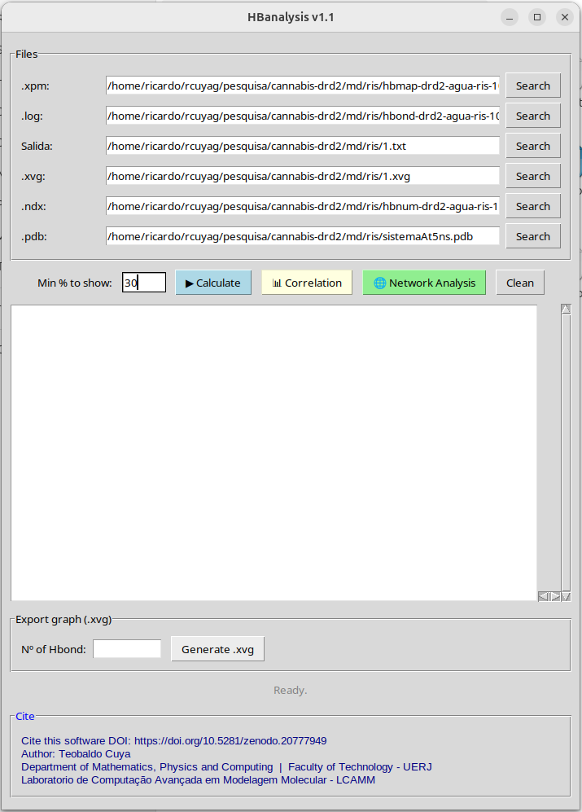
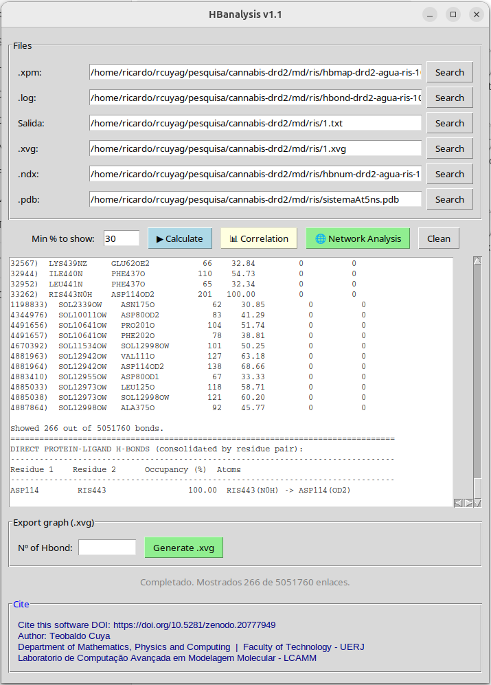
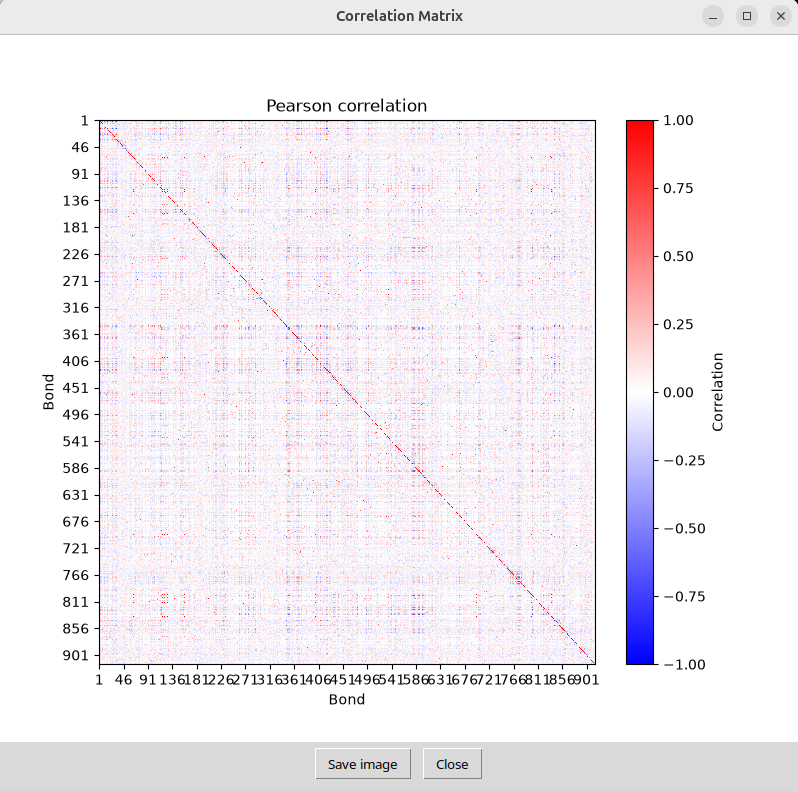
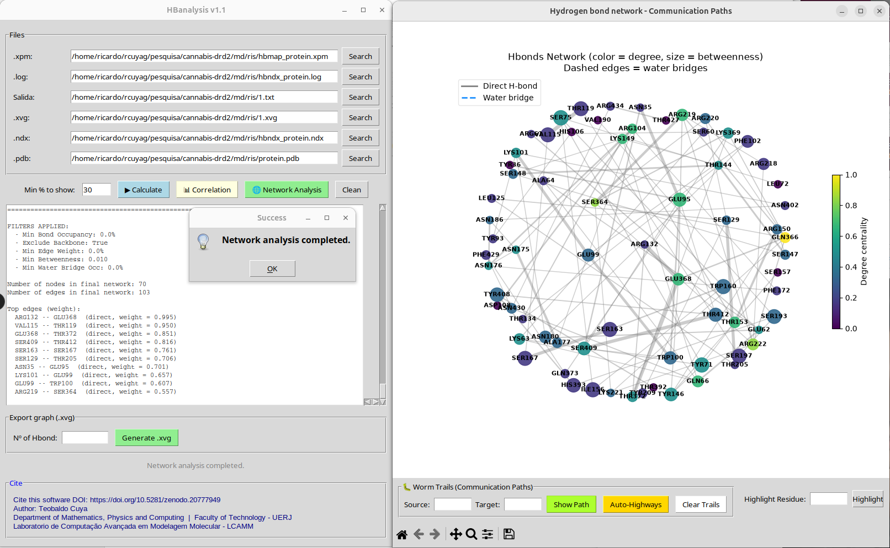

# HBanalysis-v1.1

> **Cite this software:** https://doi.org/10.5281/zenodo.20777949

HBanalysis v1.1 is a tool for H‑bond network analysis from GROMACS. It transforms raw GROMACS output files into meaningful statistical data, computes occupancy, residue pharmacophore dynamics, correlation matrices, and centrality metrics. Applicable to protein–protein, receptor–ligand, protein–DNA/RNA, and allosteric communication.

---

## Table of Contents

- [What is HBanalysis?](#what-is-hbanalysis)
- [Features](#features)
- [Input and Output Files](#input-and-output-files)
  - [Inputs](#inputs)
  - [Outputs](#outputs)
  - [How GROMACS Generates These Files](#how-gromacs-generates-these-files)
- [Installation](#installation)
- [Step-by-Step Tutorial](#step-by-step-tutorial)
  - [Step 1: Prepare Your GROMACS Files](#step-1-prepare-your-gromacs-files)
  - [Step 2: Launch HBanalysis](#step-2-launch-hbanalysis)
  - [Step 3: Load Input Files](#step-3-load-input-files)
  - [Step 4: Configure and Run the Calculation](#step-4-configure-and-run-the-calculation)
  - [Step 5: Understanding the Results Table](#step-5-understanding-the-results-table)
  - [Step 6: Export Individual H-bond Time Series](#step-6-export-individual-h-bond-time-series)
  - [Step 7: Correlation Analysis](#step-7-correlation-analysis)
  - [Step 8: Network Analysis](#step-8-network-analysis)
- [Analysis Details](#analysis-details)
  - [Prevalence Calculation](#prevalence-calculation)
  - [Direct Protein-Ligand H-bonds](#direct-protein-ligand-h-bonds)
  - [Water-Mediated Bridges](#water-mediated-bridges)
  - [Correlation Matrix](#correlation-matrix)
  - [Network Analysis and Centrality Metrics](#network-analysis-and-centrality-metrics)
- [Citation](#citation)
- [License](#license)
- [Acknowledgments](#acknowledgments)

---

## What is HBanalysis?

In molecular dynamics simulations, hydrogen bonds are fundamental for understanding molecular recognition, protein-ligand binding, protein folding, and allosteric communication. GROMACS provides basic tools to detect H-bonds, but extracting biologically meaningful insights from thousands of H-bond events across hundreds of nanoseconds requires specialized post-processing.

**HBanalysis bridges this gap by:**

1. **Consolidating H-bond data** by residue pairs rather than individual atom pairs, providing clearer biological interpretation
2. **Detecting water-mediated bridges** that facilitate indirect protein-ligand communication
3. **Quantifying H-bond cooperativity** through Pearson correlation matrices
4. **Mapping communication networks** using graph theory (centrality metrics, path finding)
5. **Filtering thermal noise** through physically meaningful thresholds

The application is particularly useful for:
- **Drug design**: Identifying key H-bonds that stabilize protein-ligand complexes
- **Allosteric studies**: Mapping H-bond networks that transmit signals across proteins
- **Solvent effects**: Quantifying the role of water bridges in molecular recognition
- **Protein engineering**: Understanding cooperative H-bond patterns for stability optimization

---

## Features

- **Occupancy Calculation**: Computes prevalence (%) for each detected H-bond across all simulation frames
- **Configurable Filtering**: Display only H-bonds above a user-defined occupancy threshold
- **Direct H-bond Consolidation**: Aggregates atom-level H-bonds into residue-pair interactions
- **Water Bridge Detection**: Identifies water molecules that simultaneously H-bond to protein and ligand, calculating co-occupancy
- **Pearson Correlation Matrix**: Visualizes statistical correlations between H-bond time series
- **Network Graph Analysis**: Constructs and visualizes H-bond networks with:
  - Degree centrality
  - Betweenness centrality
  - Closeness centrality
  - Eigenvector centrality
- **Advanced Network Filtering**: Remove thermal noise with filters for occupancy, backbone exclusion, edge weight, betweenness, and water bridge thresholds
- **Edge Type Discrimination**: Distinguishes direct H-bonds from water-mediated bridges in network visualizations
- **Path Finding**: Trace communication pathways through the H-bond network
- **XVG Export**: Generate GROMACS-compatible time series files for individual H-bonds
- **High-Resolution Image Export**: Save correlation matrices and network graphs as publication-quality images (PNG, JPEG)

---

## Input and Output Files

### Inputs

| File | Format | Description |
|------|--------|-------------|
| `.xpm` | X-Pixmap | Binary matrix where rows = H-bonds, columns = frames. Character `'o'` indicates the H-bond is present in that frame. |
| `.log` | Text | Three-column list of atom names: donor, hydrogen, and acceptor for each H-bond detected. |
| `.ndx` | GROMACS Index | Contains atom index triplets (donor, hydrogen, acceptor) as integer indices, enabling residue mapping. |
| `.pdb` | PDB | Molecular structure file used to identify residue types (protein, ligand, solvent) and atom names. |
| `.xvg` (output path) | GROMACS XVG | User-specified output path for exporting individual H-bond time series. |
| `.txt` (output path) | Text | User-specified output path for saving the results table. |

### Outputs

| File | Content |
|------|---------|
| `.txt` | Comprehensive table with: bond number, donor atom, acceptor atom, frame count, occupancy (%), number of transient instances (`#ins`), number of instances with presence (`#ins+pres`), direct protein-ligand H-bonds (if applicable), and water-mediated bridges (if applicable). |
| `.xvg` | Time series for a single selected H-bond in GROMACS XVG format (frame number vs. presence). |
| `.png` / `.jpg` | Correlation matrix heatmap or network graph (saved interactively). |

### How GROMACS Generates These Files

All input files are generated using the **`gmx hbond`** command. Below is the standard workflow:

```bash
# Step 1: Generate the H-bond analysis files
# -f: trajectory file (e.g., traj.xtc or traj.trr)
# -s: structure file (e.g., topol.tpr)
# -n: index file defining the groups to analyze
gmx hbond -f traj.xtc -s topol.tpr -n index.ndx -num hbond.xpm -log hbond.log

# During execution, GROMACS will prompt you to select:
#   Group 1: Typically the protein and ligand combined (e.g., "Protein_Ligand")
#   Group 2: Typically the same group or a subset for acceptor selection

# Step 2: Generate the index file with atom triplets
gmx hbond -f traj.xtc -s topol.tpr -n index.ndx -hbn hbond.ndx

# The .pdb file is your starting structure (e.g., complex.pdb or processed.gro converted to PDB)
```

**Detailed file generation explanation:**

- **`.xpm` file** (`-num` flag): GROMACS creates an X-Pixmap image where:
  - Each row corresponds to one detected H-bond (donor-hydrogen-acceptor triplet)
  - Each column corresponds to one frame of the trajectory
  - The pixel color/character encodes whether the H-bond exists in that frame:
    - `'o'` (white): H-bond is present
    - `'-'` (gray): H-bond was just broken (transient)
    - `'*'` (black): H-bond was just formed (transient)
- **`.log` file** (`-log` flag): A plain text file where each line contains:
  - Column 1: Donor atom name (e.g., `SER45_OG`)
  - Column 2: Hydrogen atom name (e.g., `SER45_HG`)
  - Column 3: Acceptor atom name (e.g., `LIG_O1`)
  - The line number corresponds to the row in the `.xpm` file
- **`.ndx` file** (`-hbn` flag): A GROMACS index file containing a section (typically named `[ hbonds ]`) with atom index triplets:
  - Every three consecutive numbers represent: `donor_index`, `hydrogen_index`, `acceptor_index`
  - These are **GROMACS internal atom indices** (1-based), which differ from PDB serial numbers
  - This file is essential for mapping H-bonds back to specific residues
- **`.pdb` file**: Your molecular structure, which can be:
  - The original crystal/conformer structure
  - A frame extracted from the trajectory (`gmx trjconv -s topol.tpr -f traj.xtc -dump 0 -o frame0.pdb`)
  - Converted from `.gro` format (`gmx editconf -f complex.gro -o complex.pdb`)

**Important Notes:**

- The number of H-bond rows in `.xpm`, `.log`, and `.ndx` must be consistent. HBanalysis will warn you and use the minimum if discrepancies exist.
- The `.pdb` file must contain the **same atoms** as the simulation topology; otherwise, residue mapping will fail silently.
- GROMACS atom indices in `.ndx` are 1-based and follow the order defined in your topology, which may differ from PDB atom serial numbers.

---

## Installation

### Prerequisites

- Python 3.12.3 or higher
- Required Python packages:
  ```bash
  pip install numpy matplotlib networkx
  ```

### Using the executable

Download the pre-compiled executable from the [Releases](../../releases) page and run it directly on your system.

---

## Step-by-Step Tutorial

### Step 1: Prepare Your GROMACS Files

Before launching HBanalysis, ensure you have generated all required files from your MD simulation:

```bash
# Assuming you have: traj.xtc, topol.tpr, index.ndx, complex.pdb

# Generate H-bond XPM and LOG files
gmx hbond-legacy -f traj.xtc -s topol.tpr -n index.ndx -num hbond.xpm -log hbond.log

# Generate H-bond index file with atom triplets
gmx hbond -f traj.xtc -s topol.tpr -n index.ndx -hbn hbond.ndx
```

When prompted for group selection:
- **Group 1** (donors + acceptors): Select the group containing your protein and ligand
- **Group 2** (acceptors only): Select the same group (or a subset)

Verify that all files exist:
```
hbond.xpm    <- H-bond matrix
hbond.log    <- Atom names for each H-bond
hbond.ndx    <- Atom index triplets
complex.pdb  <- Structure for residue identification
```

### Step 2: Launch HBanalysis

Run the application:
```bash
python HBanalysis.py
```

The main window will appear with:
- **Files section**: Six input fields for loading your data
- **Control buttons**: Calculate, Correlation, Network Analysis, Clean
- **Output panel**: Scrollable text area displaying results
- **Export section**: Tool for generating individual H-bond `.xvg` files

### Step 3: Load Input Files

Click the **"Search"** button next to each field to browse and select your files:

| Field | Select File |
|-------|-------------|
| `.xpm:` | `hbond.xpm` |
| `.log:` | `hbond.log` |
| `Salida:` | Choose a destination (e.g., `results.txt`) |
| `.xvg:` | Choose a destination for time series exports (e.g., `bond.xvg`) |
| `.ndx:` | `hbond.ndx` |
| `.pdb:` | `complex.pdb` |

### Step 4: Configure and Run the Calculation

1. **Set the minimum occupancy filter**: In the "Min % to show" field, enter a threshold (e.g., `10.0` to show only H-bonds present in at least 10% of frames). Set to `0.0` to show all H-bonds.
2. Click **"Calculate"**
3. **Ligand identification**: If your PDB contains HETATM records, HBanalysis will attempt to automatically identify the ligand:
   - If exactly one HETATM residue type is found -> automatically assigned as ligand
   - If multiple HETATM residue types are found -> a dialog will ask you to specify the ligand residue name (e.g., `LIG`)
   - If no HETATM records are found -> a dialog will ask if you want to specify a ligand manually, or you can cancel to skip ligand-specific analysis
4. **Solvent identification**: The program automatically recognizes common solvent names (`HOH`, `SOL`, `WAT`). If none are found, it will prompt you (default: `HOH`).
5. **Processing**: The status bar will show progress. The calculation involves:
   - Parsing the XPM matrix (binary H-bond presence data)
   - Parsing the LOG file (atom names)
   - Parsing the NDX file (atom index triplets for residue mapping)
   - Mapping atoms to residues using the PDB file
   - Calculating occupancy for each H-bond
   - Identifying direct protein-ligand H-bonds (if ligand was identified)
   - Detecting water-mediated bridges (if ligand and solvent were identified)

### Step 5: Understanding the Results Table

The output panel displays a table with the following columns:

| Column | Description |
|--------|-------------|
| `bond` | Sequential H-bond number (1-indexed) |
| `donor` | Donor atom name from the `.log` file |
| `acceptor` | Acceptor atom name from the `.log` file |
| `count` | Number of frames where this H-bond is present (`'o'` characters) |
| `%` | Occupancy percentage: `(count / total_frames) * 100` |
| `#ins` | Number of transient instances (frames marked with `'-'`, indicating the bond was just broken) |
| `#ins+pres` | Number of transient instances with presence (frames marked with `'*'`, indicating the bond was just formed) |

**Example output:**
```
Filter applied: showing bonds with occupancy >= 10.0%

bond   donor        acceptor     count        %    #ins  #ins+pres
----------------------------------------------------------------------
   1)  SER45_OG     LIG_O1            847    84.70       12         15
   2)  ASP102_OD1   LIG_N2            523    52.30       34         28
   3)  GLY78_O      HOH1234_O1        198    19.80       89         67

Showed 3 out of 847 bonds.
```

**If a ligand was identified**, additional sections appear:
```
================================================================================
DIRECT PROTEIN-LIGAND H-BONDS (consolidated by residue pair):
--------------------------------------------------------------------------------
Residue 1    Residue 2    Occupancy (%)   Atoms
--------------------------------------------------------------------------------
SER45       LIG              84.70  SER45_OG(OG) -> LIG_O1(O1)
ASP102      LIG              52.30  ASP102_OD1(OD1) -> LIG_N2(N2)

================================================================================
WATER-MEDIATED BRIDGES (protein - water - ligand):
--------------------------------------------------------------------------------
Residue 1    Residue 2    Co-occupancy (%)   Bridge details
--------------------------------------------------------------------------------
GLY78       LIG              12.40  GLY78_O(O) <-> HOH1234_O1(O1) <-> LIG_N3(N3)
```

**Key interpretation notes:**
- **Direct H-bonds** are consolidated by residue pair. If multiple atom pairs form H-bonds between the same two residues, their occupancies are combined (union of active frames).
- **Water bridges** show co-occupancy: the percentage of frames where a single water molecule simultaneously H-bonds to both the protein residue and the ligand.
- The "Atoms" column shows the specific atom-level interactions contributing to each residue-pair interaction.

### Step 6: Export Individual H-bond Time Series

To export a time series for a specific H-bond (useful for plotting in other tools like Grace/xmgrace):

1. Enter the H-bond number (from the results table) in the "No of Hbond" field (e.g., `1`)
2. Ensure the `.xvg` output path is set
3. Click **"Generate .xvg"**
4. A dialog will show a default label (e.g., `SER45_OG-HG-LIG_O1`) which you can edit
5. The resulting `.xvg` file contains frame numbers where the H-bond is present:

```xvg
# SER45_OG-HG-LIG_O1 = SER45_OG HG LIG_O1
2 SER45_OG-HG-LIG_O1
3 SER45_OG-HG-LIG_O1
5 SER45_OG-HG-LIG_O1
...
```
*Note: Frame numbers are 2-indexed (GROMACS convention where frame 1 is time 0).*

### Step 7: Correlation Analysis

The correlation analysis reveals **cooperative H-bond behavior** — H-bonds that tend to form and break together (positive correlation) or in an anti-correlated manner (negative correlation).

1. Ensure you have run **"Calculate"** first
2. Click **"Correlation"**
3. A new window opens displaying a heatmap:
   - **Red**: Positive correlation (H-bonds tend to coexist)
   - **Blue**: Negative correlation (H-bonds tend to be mutually exclusive)
   - **White**: No correlation
   - X and Y axes represent H-bond numbers from the results table
4. Use the toolbar to **zoom**, **pan**, and **explore** the matrix
5. Click **"Save image"** to export as PNG or JPEG (1200 DPI for publication quality)

**Interpretation guide:**
- Clusters of positive correlation may indicate cooperative H-bond networks
- Strong negative correlations may indicate competing conformations or alternative binding modes
- The matrix is computed using **Pearson correlation** on the binary H-bond presence vectors

### Step 8: Network Analysis

The network analysis is the most powerful feature of HBanalysis. It transforms H-bond data into a **graph** where:
- **Nodes** = residues
- **Edges** = H-bond interactions between residues (weighted by occupancy)
- **Edge types** = direct H-bonds (solid gray lines) vs. water-mediated bridges (dashed blue lines)

#### Step 8.1: Launch and Configure Filters

1. Ensure you have run **"Calculate"** first
2. Click **"Network Analysis"**
3. A **filter dialog** appears with the following options:

| Filter | Default | Purpose |
|--------|---------|---------|
| **Min. Bond Occupancy (%)** | `10.0` | Removes H-bonds below this occupancy, filtering thermal noise |
| **Exclude Backbone-Backbone H-bonds** | `Checked` | Removes secondary structure H-bonds (alpha-helices, beta-sheets) to focus on functional interactions |
| **Min. Edge Weight (Combined %)** | `10.0` | After consolidating atom-level H-bonds into residue-pair edges, removes edges below this combined occupancy |
| **Min. Betweenness Centrality** | `0.01` | Removes nodes (residues) that are not on any communication path, eliminating dead-end branches |
| **Min. Water Bridge Occ (%)** | `5.0` | Minimum co-occupancy for water-mediated bridges to be included as edges |

4. Click **"Generate Network"** to apply filters and build the graph

#### Step 8.2: Understanding the Network Visualization

The network window displays:
- **Node color** (viridis colormap): Degree centrality — how many H-bond partners each residue has
- **Node size**: Betweenness centrality — how important the residue is for communication paths (larger = more critical hub)
- **Gray solid lines**: Direct H-bonds between residues
- **Blue dashed lines**: Water-mediated bridges
- **Line thickness**: Proportional to edge weight (occupancy)
- **Node labels**: Residue name and number (e.g., `SER45`, `LIG`)

#### Step 8.3: Network Statistics

The output panel displays:
```
======================================================================
ANALYSIS OF HYDROGEN BOND NETWORKS
======================================================================

FILTERS APPLIED:
  - Min Bond Occupancy: 10.0%
  - Exclude Backbone: True
  - Min Edge Weight: 10.0%
  - Min Betweenness: 0.010
  - Min Water Bridge Occ: 5.0%

Number of nodes in final network: 12
Number of edges in final network: 18

Top edges (weight):
  SER45 -- LIG  (direct, weight = 0.847)
  ASP102 -- LIG  (direct, weight = 0.523)
  GLY78 -- LIG  (water_bridge, weight = 0.124)
  ...
```

#### Step 8.4: Centrality Metrics Explained

| Metric | What It Measures | Biological Interpretation |
|--------|------------------|---------------------------|
| **Degree Centrality** | Number of direct H-bond partners | Residues with many H-bond partners may be in flexible or highly interactive regions |
| **Betweenness Centrality** | Frequency of being on shortest paths | Critical communication hubs; removing these residues would disrupt H-bond communication networks |
| **Closeness Centrality** | Average distance to all other nodes | Residues that can quickly "reach" all others via H-bond paths; potential allosteric hotspots |
| **Eigenvector Centrality** | Connection to other well-connected nodes | Residues connected to other important residues; identifies "inner circle" of the network |

#### Step 8.5: Path Finding

The network window includes tools for tracing communication pathways between residues (worm traces). These paths show how a signal could propagate through the H-bond network from one residue to another, highlighting the cooperative chain of interactions.

---

## Analysis Details

### Prevalence Calculation

For each H-bond *i* detected by GROMACS:

```text
Prevalence_i = (count of 'o' characters in row i of XPM) / (total frames) * 100%
```

- `'o'` = H-bond present in this frame
- `'-'` = H-bond just broken (transient disruption)
- `'*'` = H-bond just formed (transient formation)

The transient counts (`#ins` and `#ins+pres`) provide information about H-bond dynamics:
- High `#ins` relative to occupancy: H-bond is unstable, forming and breaking frequently
- Low `#ins` relative to occupancy: H-bond is stable once formed

### Direct Protein-Ligand H-bonds

When a ligand is identified:
1. All H-bonds where one partner is a protein atom and the other is a ligand atom are extracted
2. H-bonds are grouped by **residue pair** (e.g., all atom-level H-bonds between SER45 and LIG)
3. Occupancy is calculated as the **union** of active frames: if any atom-pair H-bond between these residues is present in a frame, the residue-pair H-bond is considered present
4. This consolidation provides a biologically meaningful view of residue-level interactions

### Water-Mediated Bridges

Water bridges are detected through a three-step process:
1. **Identify water H-bonds**: Find all H-bonds where one partner is a solvent molecule (HOH/SOL/WAT) and the other is protein or ligand
2. **Group by water molecule**: For each water residue, collect all its H-bond partners
3. **Find bridges**: If a single water molecule H-bonds to both a protein residue AND the ligand in the **same frame**, a water bridge is recorded
4. **Co-occupancy**: The percentage of frames where this specific water bridge exists

This co-occupancy metric is more stringent than individual H-bond occupancy because it requires simultaneous formation of both H-bond arms.

### Correlation Matrix

The Pearson correlation coefficient is calculated between the binary time series of all H-bond pairs:

```text
Corr(i, j) = cov(S_i, S_j) / (sigma_i * sigma_j)
```
Where `S_i` is the binary vector (0 or 1) indicating presence/absence of H-bond *i* across frames.

**Caveats:**
- Binary data correlations tend to be compressed toward zero compared to continuous data
- Highly prevalent H-bonds (>90%) may show spurious correlations due to ceiling effects
- The full matrix (all H-bonds) can be very large; consider filtering by occupancy first

### Network Analysis and Centrality Metrics

The H-bond network is constructed as an undirected, weighted graph:
1. **Node creation**: Each residue involved in at least one filtered H-bond becomes a node
2. **Edge creation**: For each residue pair with H-bond activity, an edge is created with weight = combined occupancy
3. **Edge typing**: Edges are classified as `direct`, `water_bridge`, or `both`
4. **Backbone filtering**: If enabled, H-bonds between two backbone atoms (N, H, C, O, CA) are excluded
5. **Weight filtering**: Edges below the minimum weight threshold are removed
6. **Betweenness filtering**: Nodes below the minimum betweenness threshold are removed (eliminates dead-ends)
7. **Isolate removal**: Any remaining isolated nodes are removed

Centrality metrics are then calculated on the final filtered network, providing insight into the communication architecture of the H-bond network.

---

## Citation

If you use HBanalysis v1.1 in your research, please cite:

**DOI:** https://doi.org/10.5281/zenodo.20777949  
**Teobaldo Cuya**  
Department of Mathematics, Physics and Computing | Faculty of Technology - UERJ  
Laboratorio de Computação Avançada em Modelagem Molecular - LCAMM

---

## License

This project is licensed under MIT terms of the license included in the repository.

---

## Acknowledgments

- Linux, Python, GROMACS and free software developers
- Universidade do Estado do Rio de Janeiro - UERJ/Brasil







